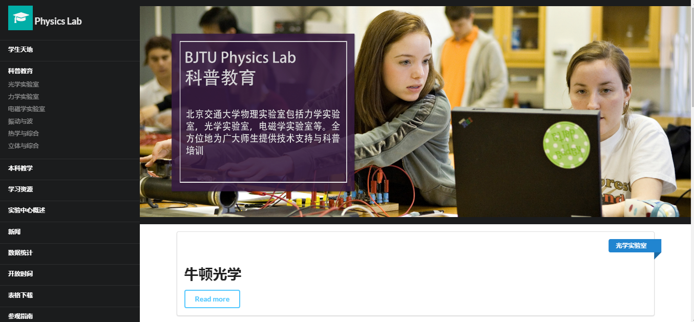
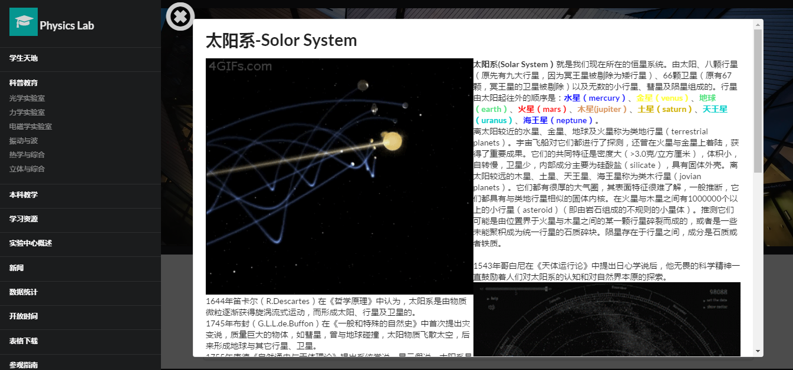
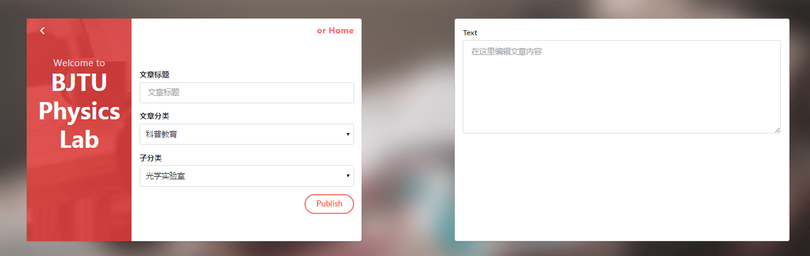

# Physics-Lab-bjtu

This program is developed for the Beijing Jiao Tong University Weihai campus physics lab. 
Using PHP,Javascript,and Vue.js 
#Usage
This project require a normal LAMP(Linux+Apache+MySQL+PHP) environment server. 
You need to edit basic information in ./config/config.php for mysql. 
.sql is also under ./config profile. 

The website provide an ugly admin system, which allow you edit and add article with HTML. 

All the image and video in this project is just for testing.Thanks for the orginal owners of this materials.

# Speical version
This is a updating version of Hao Chen (OOer), Using SemanticUI, Vue.js and is going to use jQuery to develop this website. 

# Demo

